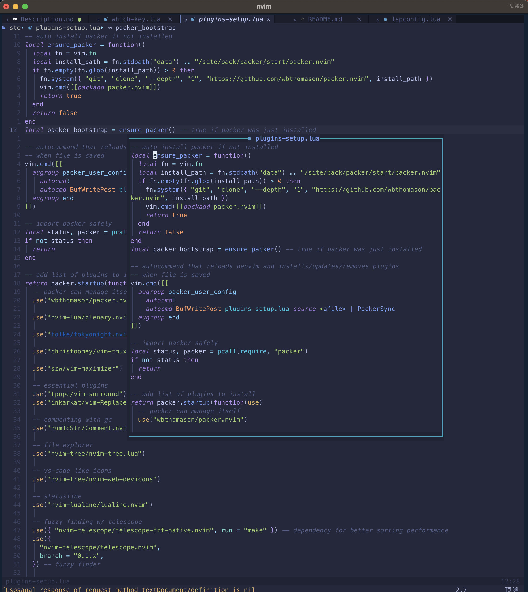

# Summary

---

Neovim 是一款现代化的文本编辑器，它是 Vim 编辑器的一个分支。Neovim 旨在提高 Vim 编辑器的可扩展性、可维护性和现代化程度，以及提供一些新功能和改进。Neovim 保留了 Vim 编辑器的许多特点和优点，如模态编辑、强大的文本编辑功能和可高度定制性，但同时还添加了一些新功能，如异步支持和插件 API，以及对其他编程语言的更好支持等。Neovim 是一款开源软件，它可以在多个操作系统上运行，并且有许多用户和开发者在维护和开发它。

## 必备功能

原始的 Neovim 只是简单的文本编辑器，打开之后会发现功能特别单一，甚至让人感觉原始。对比现在各式各样的智能代码编辑器，他没有任何优势。但 Neovim 有一个特性，它具备一个活跃的社区，大批开发者创并维护了各式各样的插件。通过插件，可以使 Vim 变得智能化，多样化，便捷化，最终具备一个智能 IDE 的基功能。

一个现代 IDE 的基本功能：

- 语法高亮
- 代码提示与补全
- 代码格式化
- 语法检查
- 代码调试

## 效果展示

- 语法高亮

几乎可以配置业界大部分热门语言的语法高亮。本例配置了 vue c/c++/C#/ oc swift java JavaScript python ruby lua shell 的语法高亮。
效果： c / ruby / python

- 代码提示与补全

同样可以配置业界大部分热门语言的语法提示与补全
效果： c

## 实现原理

### 语法功能实现原理

对比 vscode， 为什么能够通过插件支持编辑各式各样的开发语言？ 这里需要引出一个名词 lsp "language service protocol"。

LSP 是 Language Server Protocol 的缩写，它是一种通用的语言服务器协议，旨在提供一种标准化的方法来支持多种编程语言的智能化编辑器功能。简单来说，LSP 可以将编辑器与语言服务器（一个提供语言分析和代码提示等服务的后台进程）进行通信，从而为用户提供更智能化的代码编辑功能，如代码补全、错误检查、重构和导航等。

通过 LSP，用户可以在编辑器中使用相同的快捷键和菜单来使用各种编程语言的功能，而无需为每种语言安装不同的插件或扩展。目前，越来越多的编辑器和集成开发环境（IDE）已经开始支持 LSP，如 Visual Studio Code、Emacs、Vim、Sublime Text 等。同时，越来越多的语言服务器也已经实现了 LSP 协议，如 Microsoft 提供的 TypeScript、JavaScript、C#等语言的 LSP 服务器，以及 Clangd、pyls、rust-analyzer 等第三方语言服务器。[【微软】](https://microsoft.github.io/language-server-protocol/)

### 调试功能实现原理

同样拿 vscode 做说明，为什么通过各种插件，它能够调试各式各样的开发语言？ 这里同样需要引出一个名词 dap "Debug Adapter Protocol"

DAP 全称为 Debug Adapter Protocol，是一种用于开发调试工具和 IDE 集成的协议。它提供了一个标准化的调试接口，可以让不同的调试器和开发环境之间进行通信和交互。

使用 DAP 协议，开发人员可以编写通用的调试客户端和调试服务器，以实现各种语言和平台的调试功能。客户端和服务器之间使用 DAP 协议进行通信，可以传递调试信息，如调用栈、变量值、断点信息等，以及控制调试器的行为，如启动调试、停止调试、单步执行、设置断点等。

DAP 协议被越来越多的开发工具和语言所采用，例如 VS Code、Eclipse、PyCharm、GoLand 等。这些工具使用 DAP 协议来实现各种调试功能，从而提供更加便捷、统一的开发体验。同时，DAP 协议也为开发者提供了更多的调试工具和集成环境的选择，帮助开发者更加高效地进行调试和开发。

## 周边功能

除了基础的编码功能，现代智能化的 IDE 还需要支持一些辅助功能，用以提高编码效率。

- 搜索功能
- 文件树
- 文件定位
- 主题
- 快捷键
- git
- 分屏
- 终端
- 快捷注释
- 代码跳转

借助插件，可以实现这些功能。下面是效果展示：

### 全局字符搜索

### 文件树

### 主题

### 快捷键

Neovim 本质是通过命令来执行各式各样的操作。但开发者可以将命令绑定到快捷键，来实现快速触发功能。
不同于其他 IDE， Neovim 额外提供了 leader 键，来支持流式快捷键。 如图所示， leader 键是空格键， 通过 leader + w + v 可以快速纵向分出一个工作区。
借助插件，还可以在触发 leader 的时候，弹窗提示各个流式快捷键。

### git

现代开发者，项目几乎都是使用 git 做版本管理。Neovim 借助 git 插件，可以实现丰富的 git 功能。

1. git UI
   

2. 单个文件修改历史
   

### 分屏

### 终端

借助 terminal 插件，Neovim 可以集成终端功能，通过设置快捷键，可以快速唤出终端，执行终端操作。

### 快捷注释

随着使用到的语言越来越多，会出现不同语言有不一样的注释方式的情况。这种情况下，如果有统一的工具使用同一个快捷键，能够自动匹配不同语言的注释方式，将会大大提高编码的舒适感。 Neovim 和 vs code 都支持这样的方式。

### 代码跳转

如图所示，通过自定义快捷键，可以快速查看函数定义，并支持跳转到函数定义。

## 优势

Neovim 通过灵活的自定义，可以实现各式各样的便捷操作。其核心在于使用者自己编写配置文件，配置各式各样的插件，实现丰富的功能。

Neovim 有一个活跃的开源社区[【社区】](https://neovim.io/), 社区提供了丰富的插件。

最便利的一个优势，是使用者可以结合自己的使用习惯，维护一套自己的配置文件，实现所有工作电脑的环境统一化，乃至实现一件装机。尤其对于全栈开发者来说，是很便利的一件事。

例如本例，通过 install.sh 脚本，实现了一件装机。在以后更换电脑，或者重装电脑时候，可以一键装机，开箱即用。

## 结语

Neovim 并不是万能的，相反它还比较原始，很难比肩专业的 IDE。更多的适用于写一些脚本，或者简单查看文件，修改文件。

Neovim 在 dap 方面的体验没有专业 IDE 那么流畅，无法完全媲美 idea pycharm rubymine 等专业 IDE。但在快速查看代码，或者对代码做轻量改动的场景中， Neovim 有特别大优势。

Neovim 用来做 vue 开发， react 开发， shell python 开发时候，体验很丝滑。
